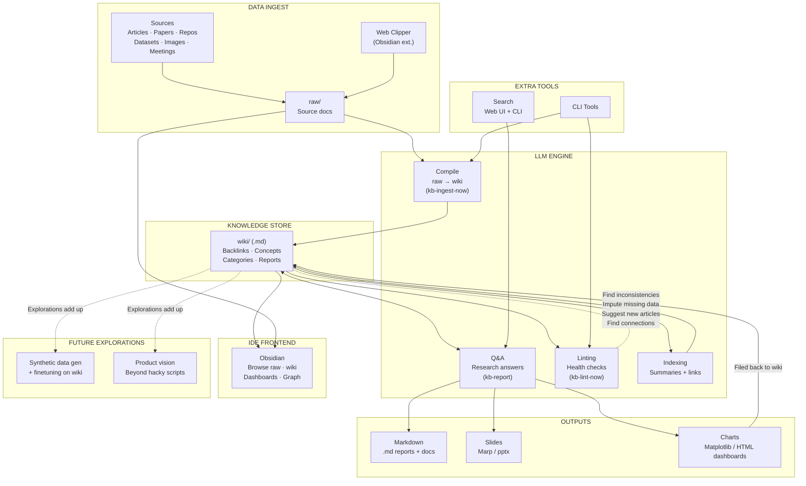
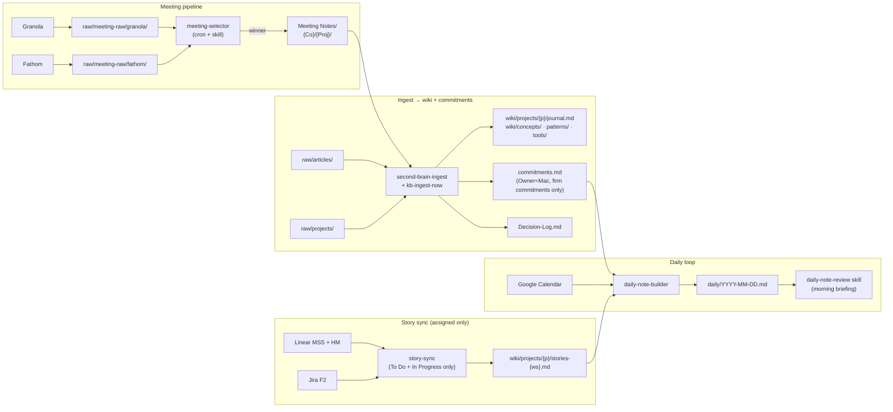

# LLM Knowledge Base — Architecture Flow

> Canonical architecture diagram for the Second Brain. Referenced from `SYSTEM-GUIDE.md` and `PEER-SETUP-GUIDE.md`. Update here; both guides re-embed.

## Diagram

![[llm-kb-architecture.png]]

> **Note:** If the PNG hasn't been dropped in yet, the image link above will be a broken embed. Save the canonical architecture image to `Second Brain/resources/diagrams/llm-kb-architecture.png` and Obsidian will resolve it automatically. The Mermaid version below renders immediately without the PNG.

## Mermaid (always-on fallback)

## How this maps to the Second Brain

| Diagram layer | What it is in the vault |
|---|---|
| **DATA INGEST** | `raw/articles/` (Web Clipper), `raw/projects/`, `raw/discovery/`, `Meeting Notes/` (Granola/Fathom), `raw/meeting-raw/` (transcripts pre-selection) |
| **LLM ENGINE — Compile** | `kb-ingest-now` skill (on-demand) + `second-brain-ingest` scheduled task. Writes action items to `commitments.md` and decisions to `Decision-Log.md` per `SCHEMA.md` extraction gates |
| **LLM ENGINE — Q&A** | `kb-report` skill — saves permanent answers to `wiki/reports/` |
| **LLM ENGINE — Linting** | `kb-lint-now` skill + `second-brain-lint` Sunday + `second-brain-lint-wed` Wednesday scheduled tasks |
| **LLM ENGINE — Indexing** | `wiki/index.md` (master catalog) and `wiki/log.md` (chronological operation log) — both auto-maintained by ingest/lint |
| **EXTRA TOOLS** | Claude Code + Cowork as CLI/chat surfaces; Obsidian Local REST API for vault access; `session-kickoff` skill for fast context briefs |
| **KNOWLEDGE STORE** | `wiki/` — `projects/`, `concepts/`, `patterns/`, `tools/`, `entities/`, `articles/`, `topics/`, `reports/`, `f2-internal/` |
| **OUTPUTS** | Generated via `docx`, `pptx`, `xlsx`, `pdf` skills + `wiki/reports/` markdown. Dashboards under `dashboards/` (Dataview-powered) |
| **IDE FRONTEND** | Obsidian with Dataview, Tasks, Calendar, Kanban, Templater, Tag Wrangler, Make.md, Excalidraw, Obsidian Git, Web Clipper |
| **FUTURE EXPLORATIONS** | Synthetic data + finetuning on curated wiki; productized tooling (beyond scheduled-task scripts) |

## Meeting + Story sub-flows (Second Brain specific)

---

*Last updated: 2026-04-18. Source of truth for Second Brain architecture. Keep diagram in sync with `SCHEMA.md` and `SYSTEM-GUIDE.md` updates.*
